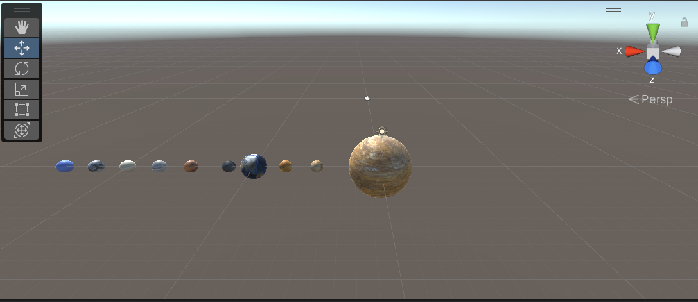
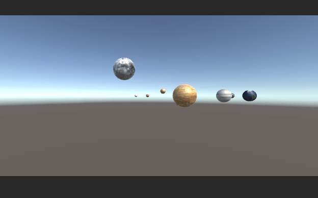
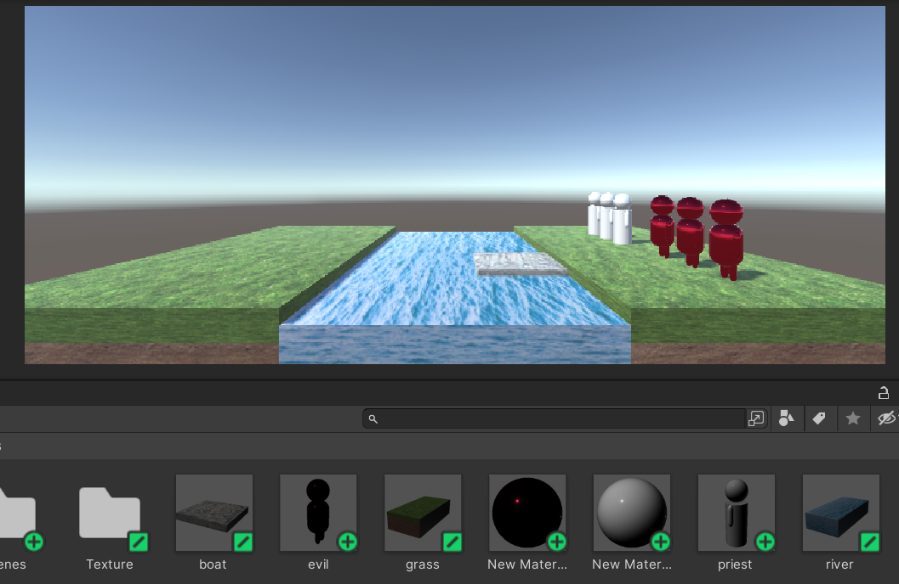
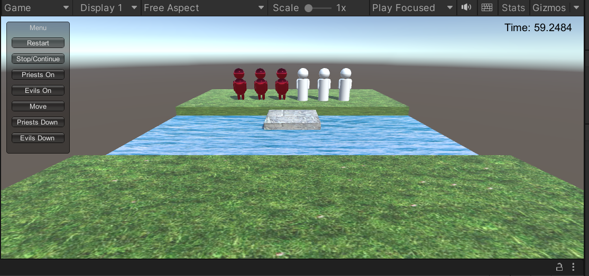
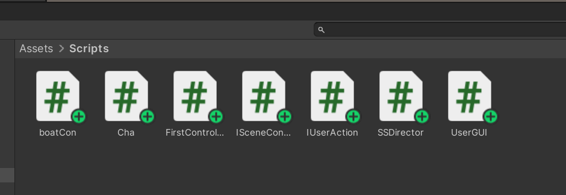

# 太阳系转动

## 实现一个完整的太阳系，其他星球围绕太阳转速必须不一样，且不在一个法平面上

首先，设计各星球，进行贴图如下：


编写代码如下：
```
using System.Collections;
using System.Collections.Generic;
using UnityEngine;

public class RoundSun : MonoBehaviour
{
    public Transform sun;
    public Transform mercury;
    public Transform venus;
    public Transform earth;
    public Transform moon;
    public Transform mars;
    public Transform jupiter;
    public Transform saturn;
    public Transform uranus;
    public Transform neptune;

    // Start is called before the first frame update
    void Start()
    {
        sun.position = Vector3.zero;
        mercury.position = new Vector3(6,0,0);
        venus.position = new Vector3(9,0,0);
        earth.position = new Vector3(11,0,0);
        moon.position = new Vector3(14,0,0);
        mars.position = new Vector3(17,0,0);
        jupiter.position = new Vector3(20,0,0);
        saturn.position = new Vector3(23,0,0);
        uranus.position = new Vector3(26,0,0);
        neptune.position = new Vector3(29,0,0);
    }

    // Update is called once per frame
    void Update()
    {
        earth.RotateAround(sun.position,Vector3.up,10*Time.deltaTime);
        sun.Rotate(Vector3.up*30*Time.deltaTime);
        moon.RotateAround(earth.position,Vector3.up,359*Time.deltaTime);
        mercury.RotateAround(sun.position,new Vector3(0,6,8),16*Time.deltaTime);
        venus.RotateAround(sun.position,new Vector3(0,6,8),12*Time.deltaTime);
        mars.RotateAround(sun.position,Vector3.up,8*Time.deltaTime);
        jupiter.RotateAround(sun.position,Vector3.up,6*Time.deltaTime);
        saturn.RotateAround(sun.position,Vector3.up,3*Time.deltaTime);
        uranus.RotateAround(sun.position,new Vector3(0,6,8),2*Time.deltaTime);
        neptune.RotateAround(sun.position,Vector3.up,1*Time.deltaTime);
    }
}

``` 

实现效果如下：

# Priests and Devils
Priests and Devils is a puzzle game in which you will help the Priests and Devils to cross the river within the time limit. There are 3 priests and 3 devils at one side of the river. They all want to get to the other side of this river, but there is only one boat and this boat can only carry two persons each time. And there must be one person steering the boat from one side to the other side. In the flash game, you can click on them to move them and click the go button to move the boat to the other direction. If the priests are out numbered by the devils on either side of the river, they get killed and the game is over. You can try it in many > ways. Keep all priests alive! Good luck!

翻译：祭司与恶魔是一款益智游戏，在游戏中你将帮助祭司和恶魔在限定时间内过河。有三个牧师和三个魔鬼在河的一边。他们都想到河的对岸去，但是只有一条船，而且这条船每次只能载两个人。而且必须有一个人把船从一边转向另一边。在flash游戏中，你可以点击它们来移动它们，点击go按钮来移动船到另一个方向。如果在河的任何一边，祭司的数量被魔鬼所超过，他们就会被杀死，游戏也就结束了。你可以用很多方法来尝试。让所有牧师活下去!好运！


## 列出游戏中提及的事物

牧师：由题意应有三个。

恶魔：由题意应有三个。

河：两岸中间应有一条河。

两岸：河的两岸，牧师和恶魔要从一边到另一边。

船：河上应有一条船，每次限载2人。

## 用表格列出玩家动作表（规则表），越少越好
|  动作名  |  内容  |
|----------|--------------|
|上船|选择乘坐船的一人或者两人|
|划船|使船从河岸的一边到另一边|
|下船|选择船上的人下船|

## 将游戏中对象做成预制

制作预制如图所示：


其中，白色小人代表牧师，红色小人代表恶魔，中间的木筏代表船。

## 制作结果

### 界面效果
在实际编写中，因能力有限，并没能实现通过点击GameObject来进行操作，而是使用了Button。
界面如下：


### 代码编写

按照要求，使用MVC模型。创建了如下脚本。（完整代码见Assets/Scripts）


首先是Model部分，为了实现该游戏，创建了Cha类，代表Charactor，代码如下：
```
public class Cha{
        public GameObject cha;
        public int num;
        public int kind;//priest:0,evil:1
        public int Cwhere;//右：0，左：1，船上：-1
        public Cha(GameObject obj,int b,int k){
            cha=obj;
            num=b;
            kind=k;
            Cwhere=0;
        }
    }
```
然后是代表船的boatCon，该类中也具体的实现了一些需要用到的操作，代码如下：
```
public class boatCon{
        public GameObject boatm;
        public int boatWhere;
        public Cha[] roles=new Cha[2];
        IUserAction useraction;
        int speed = 10;
        public boatCon(GameObject obj){
            useraction = SSDirector.getInstance().currentSceneController as IUserAction;
            boatm=obj;
            boatWhere=0;
        }
        public bool AddRoles(Cha t){
            if(roles[0]!=null&&roles[1]!=null) return false;
            if(t.Cwhere!=boatWhere) return false;
            if(roles[0]!=null) {
                roles[1]=t;
                t.cha.transform.position = Vector3.MoveTowards(t.cha.transform.position,new Vector3(1,(float)2.8,3-boatWhere*6),speed);
                t.Cwhere=-1;
            }
            else{
                roles[0]=t;
                t.cha.transform.position = Vector3.MoveTowards(t.cha.transform.position,new Vector3(-1,(float)2.8f,3-boatWhere*6),speed);
                t.Cwhere=-1;
            }
            return true;
        }
        public void RemoveRoles(int i){
            if(roles[0]!=null&&roles[0].kind==i){
                roles[0].Cwhere=boatWhere;
                roles[0].cha.transform.position = Vector3.MoveTowards(roles[0].cha.transform.position,new Vector3(5-2*roles[0].num,(float)2.8,8-boatWhere*16),speed);
                Cha tep = roles[0];
                roles[0] = null;
                return;
            }
            if(roles[1]!=null&&roles[1].kind==i){
                roles[1].Cwhere=boatWhere;
                roles[1].cha.transform.position = Vector3.MoveTowards(roles[1].cha.transform.position,new Vector3(5-2*roles[1].num,(float)2.8,8-boatWhere*16),speed);
                Cha tep = roles[1];
                roles[1] = null;
            }
            return;
        }
    }
```
接下来是Controller。
创建SSDirector，是单实例的，代码如下：
```
public class SSDirector : System.Object
{    
    private static SSDirector _instance;
    public ISceneController currentSceneController { get;set; }
    public bool running { get;set; }
    public static SSDirector getInstance(){
        if(_instance==null){
            _instance = new SSDirector();
        }
        return _instance;
    }
}
```
接着是SceneCroller,这里创建了FirstController，其实现了IUserAction和ISceneController接口，代码如下：

```
public class FirstController : MonoBehaviour,ISceneController,IUserAction
{
    GameObject river;
    GameObject land1;
    GameObject land2; 
    boatCon boat;
    int statue=0;
    List<Cha> charactor=new List<Cha>();
    int speed=10;
    void Awake(){
        SSDirector director = SSDirector.getInstance();
        director.currentSceneController = this;
        director.currentSceneController.LoadResources(); 
    }
    public void LoadResources(){
        river = Instantiate(Resources.Load("Prefabs/river"), new Vector3(0,(float)-2.5,0), Quaternion.identity, null) as GameObject;
        land1 = Instantiate(Resources.Load("Prefabs/grass"), new Vector3(0,0,10), Quaternion.identity, null) as GameObject;
        land2 = Instantiate(Resources.Load("Prefabs/grass"), new Vector3(0,0,-10), Quaternion.identity, null) as GameObject;
        boat = new boatCon(Instantiate(Resources.Load("Prefabs/boat"), new Vector3(0,0,3), Quaternion.identity, null) as GameObject);
        for(int i=0;i<3;i++){
            Vector3 a=new Vector3(5-2*i,3,8);
            GameObject obj = Instantiate(Resources.Load("Prefabs/priest"),a, Quaternion.identity, null) as GameObject;
            charactor.Add(new Cha(obj,(int)(5-a.x)/2,0));
        }
        for(int i=0;i<3;i++){
            Vector3 a=new Vector3(-1-2*i,3,8);
            GameObject obj = Instantiate(Resources.Load("Prefabs/evil"),a, Quaternion.identity, null) as GameObject;
            charactor.Add(new Cha(obj,(int)(5-a.x)/2,1));
        }
    }
    public void Restart(){
        if(statue==1)return;
        for(int i=0;i<6;i++){
            charactor[i].cha.transform.position = new Vector3(5-2*i,3,8);
            charactor[i].Cwhere=0;
        }
        boat.roles[0]=null;
        boat.roles[1]=null;
        boat.boatm.transform.position = new Vector3(0,0,3);
        boat.boatWhere=0;
        statue=0;
    }
    public void ChooseCha(int i){
        if(statue!=0) return;
        for(int j=0+3*i;j<6;j++){
            if(boat.AddRoles(charactor[j])) break;
        }
    }
    public void MoveBoat(){
        if(statue!=0) return;
        if(boat.roles[0]==null&&boat.roles[1]==null) return;
        boat.boatWhere = 1-boat.boatWhere;
        statue =1;
    }
    public void RemoveCha(int i){
        if(statue!=0) return;
        boat.RemoveRoles(i);
    }
    public string check(){
        if(statue!=0) return " ";
        int re=0,rp=0,le=0,lp=0;
        for(int i=0;i<6;i++){
            if(charactor[i].kind==0){
                if(charactor[i].Cwhere==0) rp++;
                else if(charactor[i].Cwhere==-1&&boat.boatWhere==0) rp++;
                else lp++;
            }
            else{
                if(charactor[i].Cwhere==0) re++;
                else if(charactor[i].Cwhere==-1&&boat.boatWhere==0) re++;
                else le++;
            }
        }
        statue=2;
        if(re>rp&&rp!=0) {
            return "Game Over";  
        }
        else if(le>lp&&lp!=0) {
            return "Game Over";
        }
        else if(lp==3&&le==3) {
            return "You Win!";
        }
        statue=0;
        return " ";
    }
    void Start()
    {  
    }
    void Update(){
        if(statue==1){
            Vector3 target = new Vector3(0,0,3-6*boat.boatWhere);
            boat.boatm.transform.position = Vector3.MoveTowards(boat.boatm.transform.position,target,speed*Time.deltaTime);
            if(boat.roles[0]!=null)
                boat.roles[0].cha.transform.position = Vector3.MoveTowards(boat.roles[0].cha.transform.position,new Vector3(-1,(float)2.8,3-6*boat.boatWhere),speed*Time.deltaTime);
            if(boat.roles[1]!=null)
                boat.roles[1].cha.transform.position = Vector3.MoveTowards(boat.roles[1].cha.transform.position,new Vector3(1,(float)2.8,3-6*boat.boatWhere),speed*Time.deltaTime);
            if(boat.boatm.transform.position==target) statue=0;
        }
    }
}
```
其中，两个接口代码如下：
```
public interface IUserAction  
{
    void ChooseCha(int i);
    void RemoveCha(int i);
    void MoveBoat();
    void Restart();
    string check();
}
public interface ISceneController 
{
    void LoadResources();
}

```
最后是View，编写了UserGUI，实现了用户交互界面的创建，通过调用IUserAction接口的操作，来得到想要的效果，代码如下：
(计时操作因为需要用到一些参数，没有实现分离)
```
public class UserGUI : MonoBehaviour
{
    private IUserAction action;
    private string gameMessage=" ";
    GUIStyle style,bigstyle;
    private float time=60;
    private int st=1;
    private int timego=1;
    // Start is called before the first frame update
    void Start()
    {
        action = SSDirector.getInstance().currentSceneController as IUserAction;

        style = new GUIStyle();
        style.normal.textColor = Color.white;
        style.fontSize = 70;

        bigstyle = new GUIStyle();
        bigstyle.normal.textColor = Color.black;
        bigstyle.fontSize = 20;
    }
    void OnGUI(){
        GUI.Box(new Rect(10,10,120,250), "Menu");
        if(GUI.Button(new Rect(20,40,100,20), "Restart"))
        {
            action.Restart();
            gameMessage = " ";
            time = 60;
            st=1;
        }
        if(GUI.Button(new Rect(20,70,100,20), "Stop/Continue"))
        {
            timego=1-timego;
            st = timego;
        }
        if(GUI.Button(new Rect(20,100,100,20), "Priests On"))
        {
           if(st==1) action.ChooseCha(0);
        }
        if(GUI.Button(new Rect(20,130,100,20), "Evils On"))
        {
           if(st==1) action.ChooseCha(1);
        }
        if(GUI.Button(new Rect(20,160,100,20), "Move"))
        {
           if(st==1) action.MoveBoat();
        }
        if(GUI.Button(new Rect(20,190,100,20), "Priests Down"))
        {
            if(st==1) action.RemoveCha(0);
        }
        if(GUI.Button(new Rect(20,220,100,20), "Evils Down"))
        {
            if(st==1) action.RemoveCha(1);
        }
        GUI.Label(new Rect(370, 200, 180, 200), gameMessage,style);
        GUI.Label(new Rect(Screen.width - 150,10,100,50), "Time: " + time, bigstyle);
    }
    void Update(){
        string a= action.check();
        if(a!=" ")gameMessage = a;
        if(gameMessage==" "&&timego==1){
            time-=Time.deltaTime;
            if(time==0){
                gameMessage = "Game Over";
                st=0;
            } 
        }
    }
}

```
### 结果展示

（效果视频见链接：https://live.csdn.net/v/246519）
